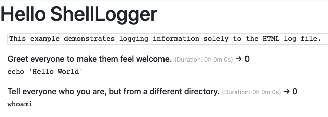
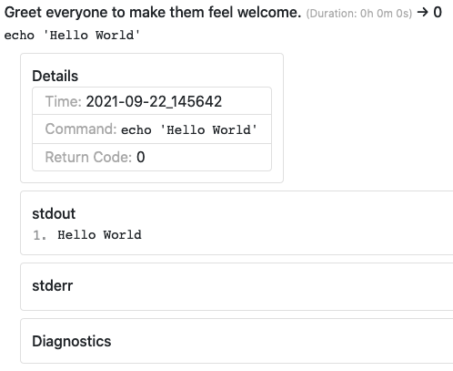
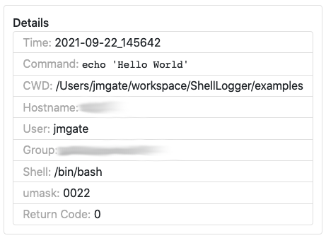
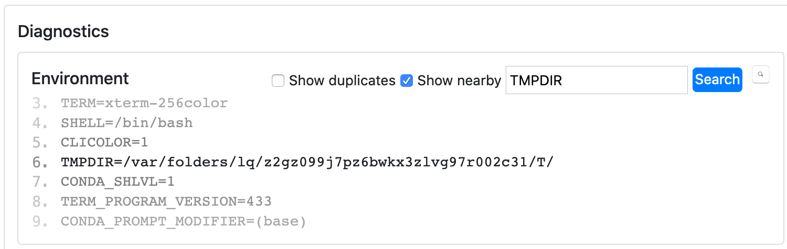
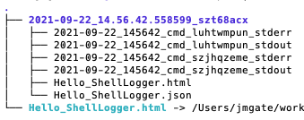

shell-logger
============

.. toctree::
   :hidden:
   :maxdepth: 3
   :caption: Contents

   shell_logger
   shell
   abstract_method
   stats_collector
   trace
   html_utilities

The ``shell-logger`` Python package allows you to interact with the shell,
while logging various metadata, statistics, and trace information.  Any time
you're tempted to write your own wrapper around things like
:class:`subprocess.Popen` or :func:`subprocess.run`, consider using
:func:`ShellLogger.log` instead.  If you're familiar with `the Unix script
command`_, this is similar in principle, but with substantially more
functionality.  If you're familiar with `Python's logging module`_, the
motivation is similar, but this intends to capture what's happening *in the
shell* rather than in Python itself.

.. _the Unix script command: https://man7.org/linux/man-pages/man1/script.1.html
.. _Python's logging module: https://docs.python.org/3/library/logging.html

The following talk from the `US-RSE Virtual Workshop 2021`_ illustrates the
module's functionality.

.. _US-RSE Virtual Workshop 2021: https://us-rse.org/virtual-workshop-2021/

.. raw:: html

    

        <iframe src="https://www.youtube.com/embed/P32RYY_2V7w?start=5985"
                frameborder="0"
                allowfullscreen
                style="position: absolute;
                       top: 0;
                       left: 0;
                       width: 100%;
                       height: 100%;
                       padding: 10px;">
        </iframe>
    

Where to Get shell-logger
-------------------------

The source repository for this module can be found `on GitHub`_.  See the
project's `README`_ for details on how to clone, install, and otherwise
interact with the project.

.. _on GitHub: https://github.com/sandialabs/shell-logger
.. _README: https://github.com/sandialabs/shell-logger/blob/master/README.md

Using shell-logger
------------------

At a high-level, :func:`ShellLogger.log` allows you to execute commands, given
as strings, in the shell.  When a command is executed, :class:`ShellLogger`
will also collect the following information:

* The command run
* A description of the command, or why it was run
* ``stdout`` and ``stderr``
* Environment variables
* Working directory
* Hostname
* User and group
* Umask
* Return code
* Ulimit
* Command start/stop time and duration

It can also optionally collect:

* Resource usage (CPU, memory, disk)
* Trace information (``strace``, ``ltrace``)

These data are collected in a "log book".  When you call
:func:`ShellLogger.finalize`, the contents of the log book are written to a
HTML log file.

Example 1:  The Basics
^^^^^^^^^^^^^^^^^^^^^^

For this initial example, let's first consider a simple "Hello World" script
written in bash:

.. literalinclude:: ../../example/hello_world.sh
   :language: bash
   :linenos:
   :caption: ``example/hello_world.sh``

The equivalent Python script written with ``shell-logger``, demonstrating its
basic functionality where it's logging commands only to the HTML log file, is
the following:

.. literalinclude:: ../../example/hello_world_html.py
   :language: python
   :linenos:
   :lines: 11-
   :caption: ``example/hello_world_html.py``

Running the script yields

.. code-block::

   This example demonstrates logging information solely to the HTML log file.
   Open <path-to-example-dir>/log_hello_world_html/<timestamp>_<unique-str>/Hello_ShellLogger.html to view the log.

When you open that file, you'll see something like

When you first open the log file, most of the content will be collapsed.  You
can click on any of the commands to expand it.

Here you can see some details, along with ``stdout`` and ``stderr``.  Clicking
on **Details** yields even more information:

Similarly, clicking **Diagnostics** gives you even more information:

Note that some of the cards allow you to search the output via a regular
expression, which can be really helpful when debugging.

If you look inside the log directory that's created by :class:`ShellLogger`,
you'll see the following:

* The timestamped log directory is created with each run of the script.  Any
  future runs of the script will create additional timestamped log directories
  as siblings.  This is to ensure you never accidentally overwrite a prior log.
* Within the timestamped log directory, you'll notice a number of files that
  contain the ``stdout`` and ``stderr`` streams from the commands that were
  executed.
* Then there's the HTML log file itself, which you can open in a browser.
* Alongside it is a JSON log file that's used to construct the HTML log file,
  mapping the commands to their output streams.
* The last item is a symbolic link to the latest HTML log file.  If the script
  is run multiple times, this link is updated to always point to the latest
  log.

Example 2:  Simultaneous Logging to the Console
^^^^^^^^^^^^^^^^^^^^^^^^^^^^^^^^^^^^^^^^^^^^^^^

This next example demonstrates logging commands both to the HTML log file and
the console.  The primary differences between this and **Example 1** are the
highlighted lines below.

.. literalinclude:: ../../example/hello_world_html_and_console.py
   :language: python
   :linenos:
   :lines: 11-
   :emphasize-lines: 15-16, 22-23
   :caption: ``example/hello_world_html_and_console.py``

Example 3:  Collecting Statistics
^^^^^^^^^^^^^^^^^^^^^^^^^^^^^^^^^

In this example, we demonstrate how easy it is to capture various statistics
while running your commands in the shell.  The primary differences between this
and **Example 1** are the highlighted lines below.

.. literalinclude:: ../../example/hello_world_html_with_stats.py
   :language: python
   :linenos:
   :lines: 11-
   :emphasize-lines: 16, 22
   :caption: ``example/hello_world_html_with_stats.py``

Example 4:  Building a Code
^^^^^^^^^^^^^^^^^^^^^^^^^^^

In this final example, we use ``shell-logger`` to do some "real
work"---cloning, configuring, and building `flex
<https://github.com/westes/flex.git>`_, a fast lexical analyzer generator.
Before we do that, let's take a look at what the bash script would look like:

.. literalinclude:: ../../example/build_flex.sh
   :language: bash
   :linenos:
   :caption: ``example/build_flex.sh``

The equivalent Python script using ``shell-logger`` is the following:

.. literalinclude:: ../../example/build_flex.py
   :language: python
   :linenos:
   :lines: 11-
   :caption: ``example/build_flex.py``

More Details
------------

For more detailed usage information, see the :doc:`shell_logger` class
reference.
